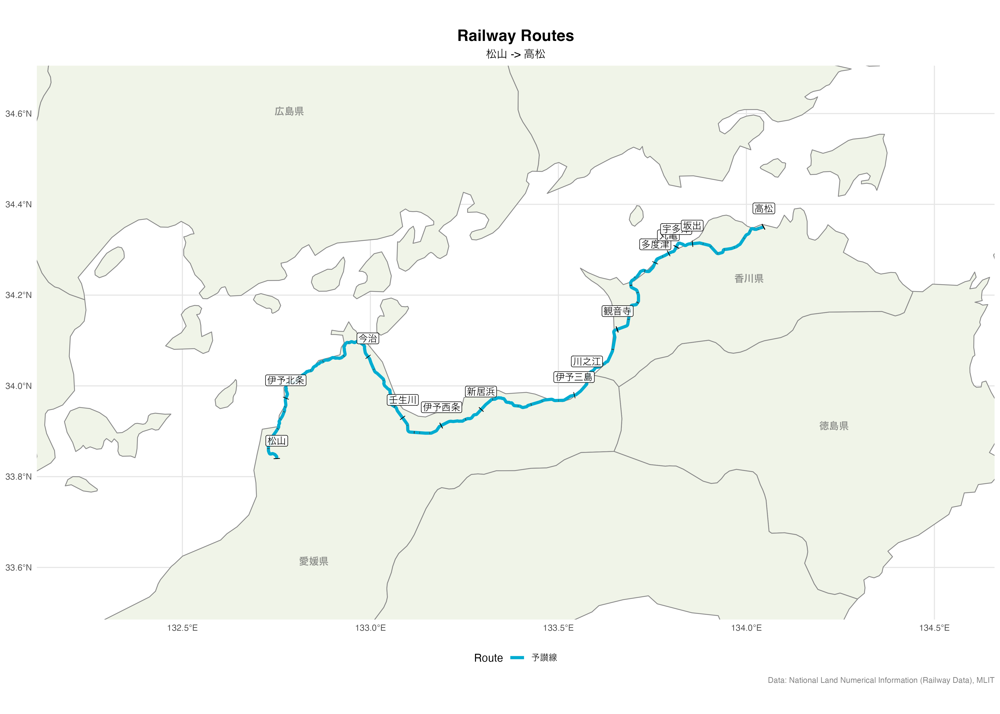
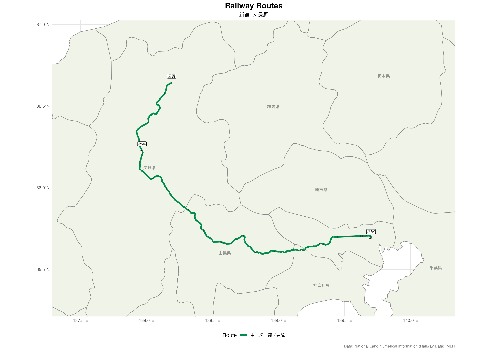
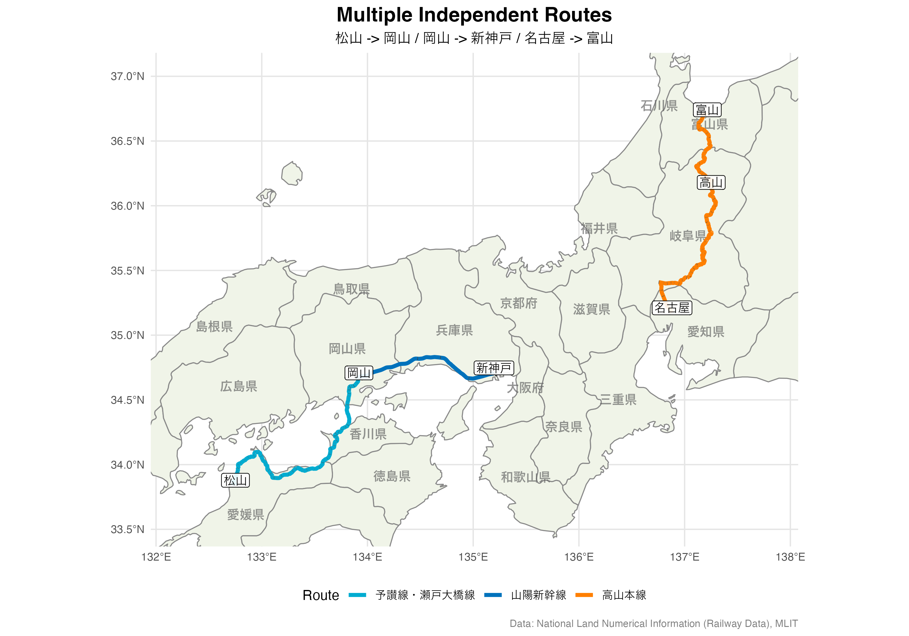
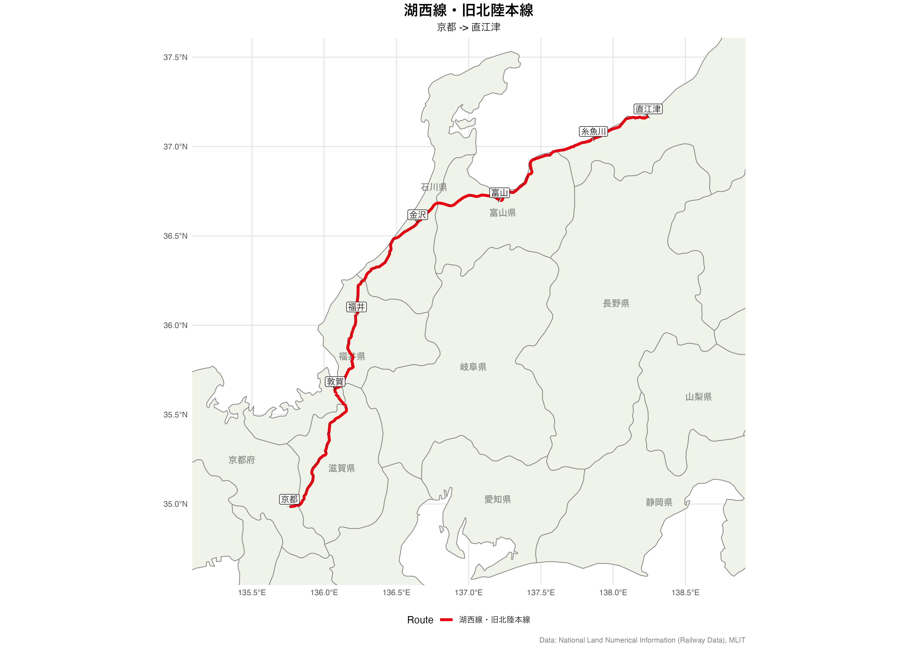

<!-- README.md is generated from README.Rmd. Please edit that file -->

```{r, include = FALSE}
knitr::opts_chunk$set(
  collapse = TRUE,
  comment = "#>",
  fig.path = "man/figures/README-",
  out.width = "100%"
)
library(railwayJP)
```

# railwayJP

## Overview

`railwayJP` is an R package for creating maps of railway routes across Japan.

It uses the National Land Numerical Information (Railway Data) from the Ministry of Land, Infrastructure, Transport and Tourism (MLIT).

## Web Application

A web-based version of this tool is available at: **https://soichiroy.github.io/railwayJP-web/**

> **Note**: The web application is currently in development. Some features may be incomplete or subject to change.

## Installation

```{r installation, eval = FALSE}
# Install from GitHub
# devtools::install_github("soichiroy/railwayJP")
```

## Quick Start

### 1. Download the data

The railway data is not included in the package due to size (~20MB). Download it on first use:

```{r download, eval = TRUE, cache = TRUE}
download_railway_data()
```

### 2. Plot a simple route

```{r simple-route, eval = TRUE}
plot_railway_segments(
  segments = list(
    list(start = "松山", end = "高松", operator = "四国旅客鉄道", label = "予讃線")
  ),
  key_stations = c(
    "高松", "坂出", "宇多津", "丸亀", "多度津", "観音寺", "川之江", "伊予三島", "新居浜",
    "伊予西条", "壬生川", "今治", "伊予北条", "松山"
  ),
  output_file = "man/figures/matsuyama_takamatsu.png",
  dpi = 300
)
```




* `key_stations`: An optional parameter that allows highlighting specific stations with labels along the route.

#### Tips: Specifying operator and line names

It is important to provide accurate operator and line names to avoid ambiguity
when the origin or destination stations are served by multiple lines.

```{r search-stations-example}
routes <- get_route(
  list(
    # Does not specify operator - return routes that include multiple lines
    list(start = "松山", end = "三津浜"),
    # Specify operator to get a unique route
    list(start = "松山", end = "三津浜", operator = "四国旅客鉄道")
  )
)
```


* In the first example, without specifying an operator, the algorithm finds a route that includes segments from 伊予鉄道 (Iyo Railway). However, there is no direct connection between 西衣山 and 三津浜 on this route.
* In the second example, by specifying `operator = "四国旅客鉄道"` (JR Shikoku), the algorithm correctly identifies the 予讃線 (Yosan Line) route.

### 3. Plot multiple routes with via points

The function supports a segment that spans over multiple lines. 
For example, going from 新宿 to 長野 using 在来線, we need to transfer at 松本.

```{r multiple-routes, eval = TRUE}
plot_railway_segments(
  segments = list(
    # Route via Matsumoto (Chuo Line) instead of Shinkansen
    list(
      start = "新宿",
      end = "長野",
      via = c("松本"),
      operator = "東日本旅客鉄道",
      label = "中央線・篠ノ井線"
    )
  ),
  title = "Railway Routes",
  key_stations = c("新宿", "松本", "長野"),
  show_legend = TRUE,
  output_file = "man/figures/railway_routes.png",
  dpi = 300
)
```




### 4. Multiple independent routes

You can plot multiple independent routes on the same map by providing multiple segments.

```{r multiple-independent-routes, eval = TRUE}
plot_railway_segments(
  segments = list(
    # Route 1: Matsuyama to Shin-Kobe
    list(
      start = "松山",
      end = "岡山",
      via = "児島",
      label = "予讃線・本四備讃線",
      operator = c("四国旅客鉄道", "西日本旅客鉄道")
    ),
    list(
      start = "岡山",
      end = "新神戸",
      line = "山陽新幹線",
      label = "山陽新幹線"
    ),
    # Route 2: Nagoya to Toyama via Takayama Line
    list(
      start = "名古屋",
      end = "富山",
      via = c("岐阜", "高山"),
      operator = c("東海旅客鉄道", "西日本旅客鉄道"),
      label = "高山本線"
    )
  ),
  title = "Multiple Independent Routes",
  key_stations = c("松山", "岡山", "新神戸", "名古屋", "高山", "富山"),
  show_legend = TRUE,
  output_file = "man/figures/multiple_routes.png",
  dpi = 300
)
```



#### Tips: Visualizing a long route across multiple operators

When visualizing a long route that spans multiple operators,
you can approximate the route by specifying intermediate stops
using the `via` argument.

For example, back in 2007 I took a train from 京都 to 新潟 via the 北陸本線,
which was solely operated by JR at the time.
Visualizing this route is tricky because it is now operated by multiple third-party companies.

```{r approximate-long-routes, eval = TRUE}
plot_railway_segments(
  segments = list(
    list(
      start = "京都",
      end = "直江津",
      via = c("比叡山坂本", "敦賀", "福井", "金沢", "富山", "黒部", "糸魚川"),
      label = "湖西線・旧北陸本線"
    )
  ),
  title = "湖西線・旧北陸本線",
  key_stations = c("京都", "敦賀", "福井", "金沢", "富山", "糸魚川", "直江津"),
  show_legend = TRUE,
  output_file = "man/figures/hokuriku_line.png",
  dpi = 300
)
```



While the detected route is not perfect, the visual line on the map 
captures key topological features of the route.

## Segment Options

Each segment in the `segments` list can have the following options:

| Option | Required | Description |
|--------|----------|-------------|
| `start` | Yes | Start station name (use `search_stations()` to find names) |
| `end` | Yes | End station name |
| `via` | No | Character vector of intermediate stations |
| `line` | No | Filter to specific line name, e.g., `"東海道線"` or `"東海道新幹線"` (use `search_lines()` to find names) |
| `operator` | No | Filter to specific operator (use `list_operators()` to see all) |
| `color` | No | Custom color (hex code) |
| `label` | No | Label for legend |

Use `search_lines()` to find the exact line name:

```{r search-lines-example}
search_lines("東海道")
```

## Plot Options

| Option | Default | Description |
|--------|---------|-------------|
| `output_file` | "railway_map.png" | Output filename |
| `title` | "Railway Routes" | Plot title |
| `subtitle` | (auto) | Plot subtitle |
| `show_all_stations` | TRUE | Show all stations along routes |
| `key_stations` | NULL | Stations to highlight with labels |
| `show_legend` | TRUE | Show route legend |
| `width` | 14 | Plot width (inches) |
| `height` | 10 | Plot height (inches) |
| `dpi` | 300 | Output resolution |

## Utility Functions

```{r utility, eval = FALSE}
# List all railway lines
list_lines()

# Search for lines by name
list_lines("中央")

# List stations on a line
list_stations("中央線", operator = "東日本旅客鉄道")

# Search for stations
search_stations("新宿")

# List all operators
list_operators()

# Get data info
get_data_info()
```

## Operator Colors

The package includes corporate colors for major Japanese railway operators:

```{r colors, eval = FALSE}
# View all operator colors
list_operator_colors()

# Get color for specific operator
get_operator_color("東日本旅客鉄道")
```

```{r colors-demo}
# JR East green
railwayJP::get_operator_color("東日本旅客鉄道")
```

## Data Source

This package uses the National Land Numerical Information (Railway Data) from MLIT:

- **URL**: https://nlftp.mlit.go.jp/ksj/
- **Data version**: N02-22 (2022)
- **License**: MLIT Open Data License (allows redistribution and commercial use)
- **Attribution required**: "Source: National Land Numerical Information (Railway Data), MLIT"

## License

MIT License

The railway data is provided under the MLIT Open Data License, which permits reproduction, redistribution, commercial use, and derivative works with attribution.
